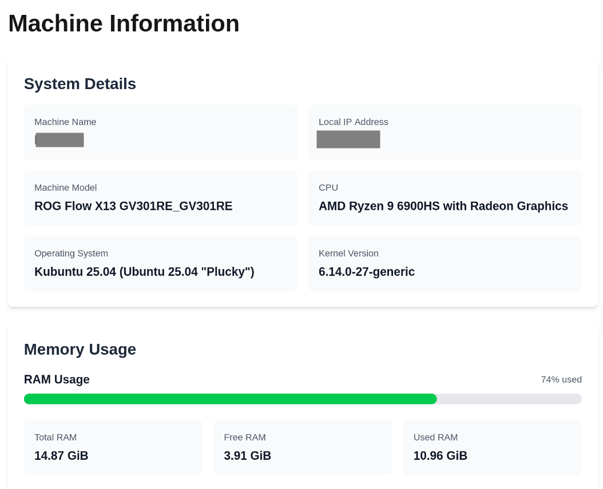

# HudApp - System Monitor Dashboard

A web-based system monitoring dashboard that provides real-time information about the machine's hardware and performance.



## Features

- **System Information**: Display hostname, IP address, machine model, CPU details, and OS information
- **Memory Monitoring**: Real-time RAM usage with visual progress bars and top memory-consuming processes
- **Disk Management**: View physical disk information and partition usage statistics
- **Cross-Platform**: Supports Linux, macOS, and Windows systems


## Getting Started

First, install the dependencies:

```bash
npm install
```

Then, run the development server:

```bash
npm run dev
```

## Build for Production

```bash
npm run build
npm start
```

## Docker Deployment

### Quick Start with Docker Compose

The easiest way to run HudApp is using Docker Compose:

```bash
# Build and run in production mode
docker-compose up --build

# Run in detached mode
docker-compose up -d --build

# Stop the application
docker-compose down
```

The application will be available at `http://localhost:3000`.

### Development with Docker

For development with hot reloading:

```bash
# Run development environment
docker-compose --profile dev up --build hudapp-dev

# The dev server will be available at http://localhost:3001
```

### Manual Docker Build

```bash
# Build the Docker image
docker build -t hudapp .

# Run the container
docker run -p 3000:3000 \
  -v /proc:/host/proc:ro \
  -v /sys:/host/sys:ro \
  -v /:/host/root:ro \
  --privileged \
  hudapp
```

### Docker Features

- **Multi-stage build**: Optimized production image with minimal size
- **System monitoring**: Mounts host system directories for hardware monitoring
- **Security**: Runs as non-root user in production
- **Development support**: Separate development container with hot reloading

### Requirements

- Docker 20.10+
- Docker Compose 2.0+

**Note**: The container requires privileged mode and host system mounts to access hardware information for monitoring features.
